# MyMTS — your own always-on news & video wall

> A self-hosted, ambient **news + live-video wall** for the TV — a private alternative to
> *monitor-the-situation.com*, built around one non-negotiable principle: **it can never become
> a path into the home network.**

A native Android TV app, a hardened NAS-side helper, and a LAN web client. Your channels, your
sources, on-by-default, calm from the couch — and a 60-second demo you can run with zero secrets.

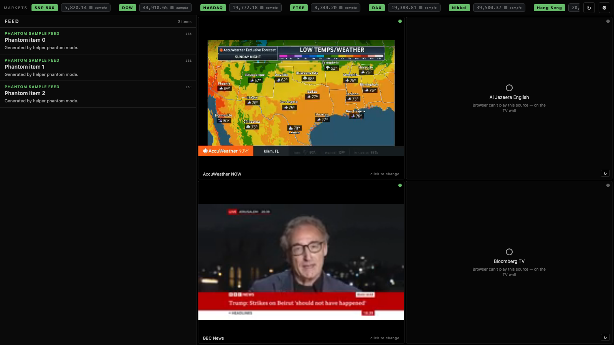

<sub>↑ the **LAN web client** in demo mode: a live video grid (real HLS playing in the playable
tiles, honest offline tiles otherwise), an agnostic news feed, and a markets ticker —
SAMPLE-labeled because the demo serves no live data (that honesty is the whole point).</sub>

[](https://github.com/wbuscombe/mymts/actions/workflows/ci.yml)
&nbsp;·&nbsp; native Android TV (Compose + Media3) &nbsp;·&nbsp; Python/FastAPI helper &nbsp;·&nbsp; LAN web client &nbsp;·&nbsp; MIT

---

## Ways to run MyMTS

Three paths, easiest first:

1. **Desktop app — no clone, no Docker, no Python.** Download the build for your OS
   from [**Releases**](https://github.com/wbuscombe/mymts/releases) and open it: a
   small **menu-bar / tray** app that runs the web wall in your browser at
   `http://127.0.0.1:8091/app/`, localhost-only, with the YouTube channels kept
   current automatically (verified yt-dlp self-update). Non-developer walkthrough:
   [`docs/DOWNLOAD-AND-RUN.md`](docs/DOWNLOAD-AND-RUN.md); build tooling:
   [`tools/desktop/`](tools/desktop/README.md). *(Early builds are unsigned — a
   one-time right-click→Open / Run-anyway.)*
2. **Developer demo — clone + phantom mode.** A 60-second, zero-secret demo on mock
   data — see [Try it in 60 seconds](#try-it-in-60-seconds-no-secrets-no-nas) below.
3. **Self-host the backend (the real wall).** Run the helper as a service for live
   data on a real TV — see [Run it for real](#run-it-for-real) →
   [`ONBOARDING.md`](ONBOARDING.md). The generic `helper/docker-compose.yml` is now a
   working **clone-to-running** path: `cd helper && cp .env.example .env && docker
   compose up` brings up the helper on `http://localhost:8091` (migrations + seed on a
   fresh DB; `/health`, `/api/channels`, and the web client at `/app/` all serve,
   keyless), then point a stock TV APK at it — the signed `mymts-<version>.apk` is
   published on the [GitHub Release](https://github.com/wbuscombe/mymts/releases) (a
   sideload; see [`DOWNLOAD-AND-RUN.md`](docs/DOWNLOAD-AND-RUN.md)). **Customize the
   lineup** (optional, no rebuild): drop a `lineup.local.json` in the helper's data
   dir to add / disable / recategorize channels on top of the shipped list (see
   `helper/lineup.local.example.json`); no file → the curated default. *(The operator's
   NAS deploy is the separate `helper/deploy/docker-compose.nas.yml`.)*

---

## Try it in 60 seconds (no secrets, no NAS)

The helper has a **demo / phantom mode** that serves mock data with **zero network egress** —
no secrets, no NAS, nothing real to leak. Clone, boot it, open the web wall:

```bash
cd helper && PHANTOM_MODE=1 PORT=8091 uv run python -m mymts_helper
#   → open http://localhost:8091/app   (the LAN web wall, mock data)
```

That's the whole thing — the ticker, the feed, the video grid, the settings, the channel
picker, all live in your browser against fixture data. Want it on a real TV emulator too?

```bash
./gradlew :app:installDebug
adb shell am start -n com.mymts/.MainActivity --es helper "http://10.0.2.2:8091"
```

Tests: `cd helper && uv run pytest` · `./gradlew :app:testReleaseUnitTest` · `node --test web/test/*.test.mjs` · `cd renderer && python3 -m unittest discover -s .` — all four run in CI and are required to pass.
Full walkthrough (real public-data path, prerequisites, troubleshooting): [`ONBOARDING.md`](ONBOARDING.md).

---

## What it does

### 📺 A live video wall
A configurable grid (independent **rows × columns**, 1–9 tiles — native parity, the same on both
screens) of public live channels — direct-HLS news/sports/weather origins, YouTube-resolved feeds,
and free **U.S. government** streams (the Senate floor, live Senate committee hearings, House
committees, and federal-agency briefings) — played in the **native player** (Media3/ExoPlayer on the
TV; vendored `hls.js` on the web). Click a tile to pick its channel from the honest lineup —
**live · plays here / live · on the TV wall only / offline** — never a black box pretending to be
live. On the web, a tile that drops **self-heals**: a transient failure reconnects on a backoff,
while a stream a browser genuinely can't play (DRM/codec) is honestly marked and **never retried
forever** — with a per-tile and whole-wall ↻ to force a fresh attempt.

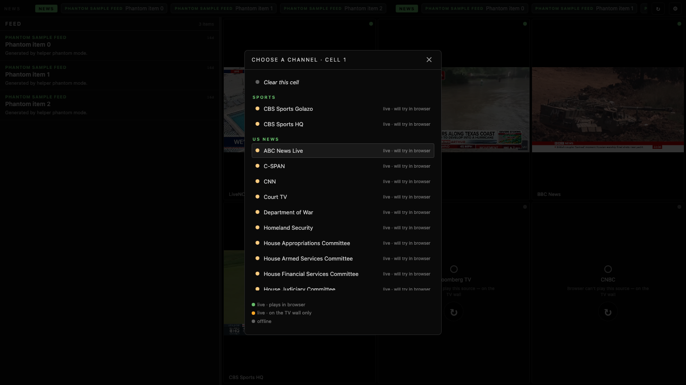

### 📰 An agnostic news feed — select a story to expand it
One newest-first river across 21 public RSS sources (BBC World, Al Jazeera, Guardian, NPR,
Bloomberg, CBS/NBC News, PBS NewsHour, Politico, opinion outlets, plus ESPN league feeds), each
headline tagged with its source and age. Rendered as
**native text** — never a WebView, never HTML from an upstream — with per-source and recency
filters. The helper strips markup and quarantines hostile input; the TV only ever sees plain text.

**Select a headline** (click, or Enter/Space on the focused row — keyboard/remote-friendly) to
**expand** it into a focused detail view: the item's own source, time, title and summary, plus a
*Read at source ↗* link-out. Closing the loop on the closed door — MyMTS shows the feed's **own
inert summary** and hands off to your browser for the full article; it never fetches or renders the
article HTML itself, and the link is gated to `http(s)` only (no `javascript:`/`data:` href).

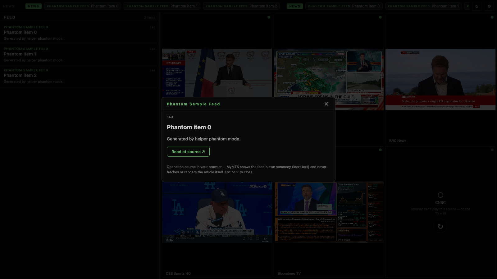

### 📈 A real ticker — markets, sports, news
Three calm rotating modes:

| | |
|---|---|
| 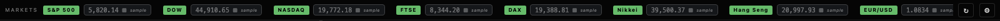 | **Markets** — live indices, FX, gold, oil, the 10-year yield (Yahoo Finance) and crypto (CoinGecko), keyless. |
| 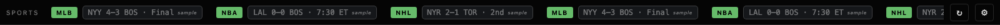 | **Sports** — 8 team leagues (NFL/NCAAF/UFL/NBA/WNBA/NCAAB/MLB/NHL) as ESPN-style game cards, **plus bespoke per-sport cards for PGA, UFC, Tennis & F1** (leaderboard / fight / match / race). |
| 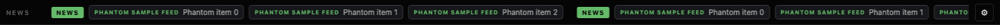 | **News** — source-labeled headlines, inert plain text. |

<sub>The screenshots above are demo mode, so every quote carries the honest `SAMPLE` tag and the
sports ticker shows team games only — the four individual-sport cards need live ESPN data and show
up on the real wall (see the device gallery below).</sub>

### ⚙️ Settings — and they're TV↔web peers
The gear opens a **native-style side menu** (a CHANNELS list + WALL actions) mirroring the TV
app; Settings and the per-slot controls (Channel · Audio · Reconnect) hang off it. A **wall
preset** selector (News Wall · Nature · Space · Chill / Mixed · Ocean · Eagles) — server-authoritative, so the helper
defines the sets and a new one needs no client rebuild; `news` is the default and identical to today —
switches the whole grid at once. Grid size
(**2×2** native default, **2×3** web default), feed width/text-size/recency, per-source toggles **grouped by category**,
sports-league toggles, ticker speed, and **ticker motion** (continuous *crawl* or paged *flip* —
both motions on both clients, each defaulting to its platform's established feel; the TV side
ships with the next on-device release) — configurable on the TV (D-pad) and in the browser
(mouse), persisted per client. The TV-only panel-fit levers (fit scale / overscan / position)
correct a physical panel and are honestly absent from the web.

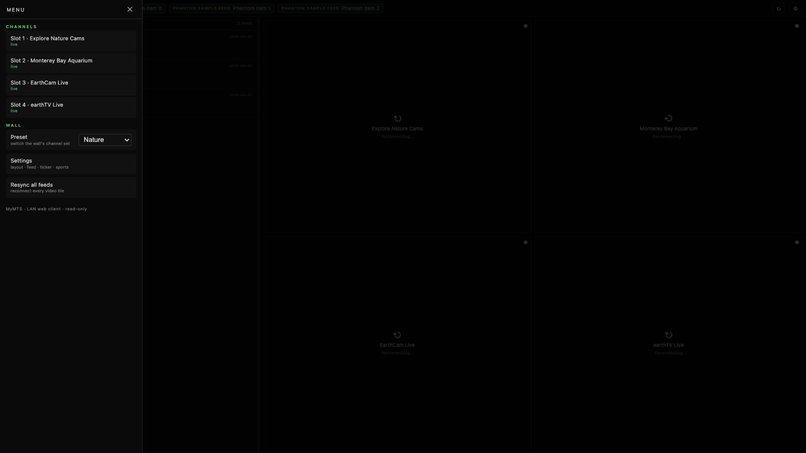

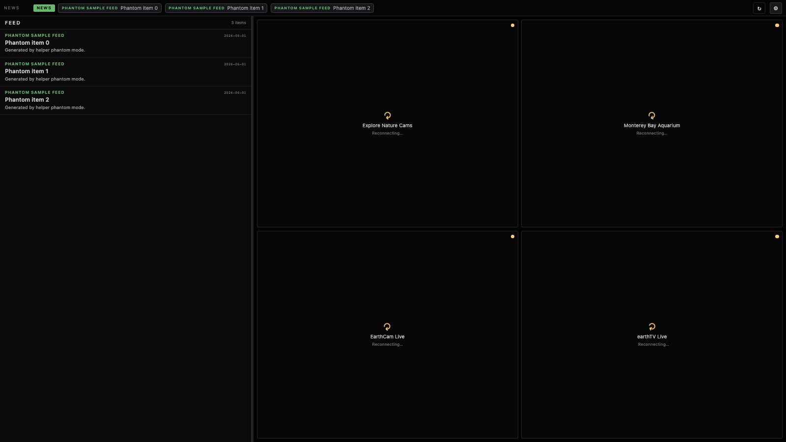

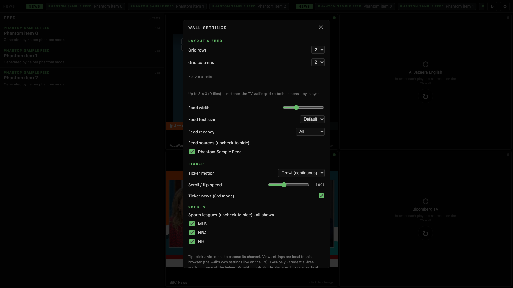

**Headless-container version — a unified control panel + a multi-output wall.** A second web
surface at `/control/` is the wall's layout in a browser, but **each cell is a feed-picker**
(channel dropdown) + **per-tile audio + subtitle toggles** (any combination audible — they mix),
**plus a display-tuning panel** (feed width, feed font, ticker height — fine-grained sliders). A cell
can also be set to **Weather Radar** (free public NWS radar loops, region-selectable) instead of a
video feed. **No video decode**, so `/control/` runs on a phone. It writes a **server-side wall
config** the rendered wall (`/app/?render=1`) reads from, so a pick drives playback. A headless
renderer container (Xvfb → Chromium → ffmpeg) **composites the wall once and fans it out to multiple
outputs**: an **Outputs panel** drives an **HLS/VLC card** (its own resolution from the 8-rung ladder
+ fine bitrate + audio + start/stop) — so **VLC or an Apple TV opens one URL** (HTTPS or a plain-HTTP
port for strict tvOS clients) — a **Mercury card** for publishing the wall into a Mercury voice
channel, and a **Discord card** for showing the wall *inside a Discord voice channel* as a launchable
Activity. *Mercury is a pre-fillable **shell pending credentials** (Ryan): the publisher is stubbed and
opens no connection in this build; the real LiveKit wire-up drops into the seam already defined.
Discord is a **launch-to-start Activity** that views the same HLS render (no extra encode) — see below.*

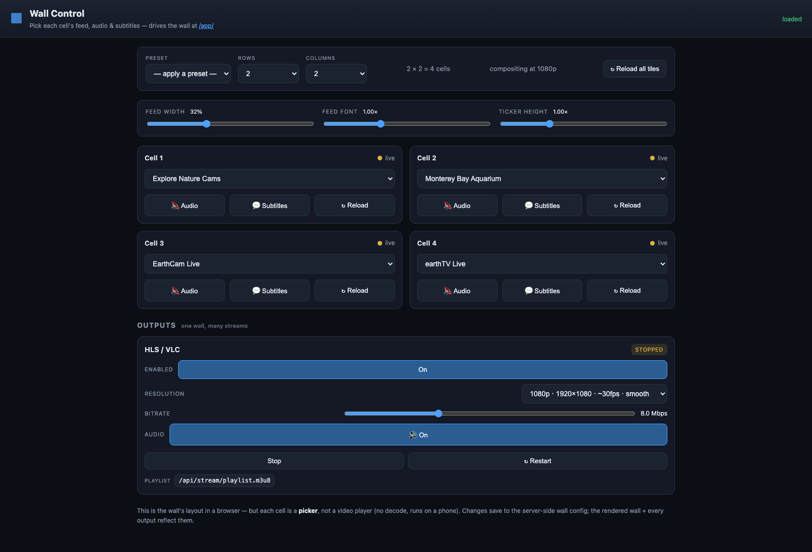

### 🎮 Discord — the wall in a voice channel
MyMTS can appear **inside a Discord voice channel** as an [Activity](https://discord.com/developers/docs/activities/overview)
(the Embedded App SDK). It's a small viewer that plays the **same HLS render** the wall already
produces — no second encode. Discord's only ToS-legitimate path for shared in-call video is a
user-launched Activity (a bot can't broadcast video unattended, and a user-token self-bot is against
ToS), so this is **launch-to-start**: configure once in `/control/`, then a user starts it from Discord
and the wall appears in the call.

The Activity is served from a **dedicated minimal public origin** behind your existing Cloudflare
tunnel — it exposes **only** the Activity, the OAuth endpoints, and an HLS passthrough. *Your LAN API,
`/control/`, and the raw stream are never exposed.* One-time operator setup:

1. **Register the app** at the [Discord Developer Portal](https://discord.com/developers/applications)
   → your application. Copy the **Application ID** (this is the *public* client id) and a **Client
   Secret**. Put them in the helper's gitignored `.env` (`DISCORD_CLIENT_ID`, `DISCORD_CLIENT_SECRET`)
   — the secret stays server-side and is never returned to the browser.
2. **Expose a public origin** for the Activity via your Cloudflare tunnel (Zero Trust → Networks →
   Tunnels → your tunnel → **Public Hostnames** → add e.g. `wall.your-domain.example` → the helper's
   public port). Set `DISCORD_ACTIVITY_PUBLIC_ORIGIN=https://wall.your-domain.example` and
   `DISCORD_PUBLIC_PORT` in `.env`.
3. **Set the Activity URL Mappings** (Developer Portal → your app → **Activities → URL Mappings**) so
   Discord proxies the Activity to your origin:

   | Prefix (Target) | URL (your public origin) |
   | --- | --- |
   | `/` | `wall.your-domain.example` |

   That single root mapping covers the Activity, `/api/discord/*`, and `/api/stream/*` (the SDK serves
   the app under `…/.proxy/` and proxies same-path requests to your origin).
4. **Enable Activities** for the app (Developer Portal → Activities → enable) and, in `/control/`,
   toggle the **Discord** card on. The card's checklist turns green when the client id/secret are
   present and the public origin is reachable.
5. **Launch it:** in a Discord voice channel → **Activities** (the rocket) → **MyMTS News Wall**. The
   wall plays in the call; tap once for sound.

The `/control/` Discord card is honest end to end: it shows `disabled / needs-setup / ready`, where
**ready means "you can launch it"** — never a fake "live session". Until you complete the steps above,
it sits in **needs-setup** and **nothing is posted to Discord**.

### 🟢 Honest degradation — a design value, not an afterthought
This is the differentiator. **The wall never fakes liveness.** Sample data wears a `SAMPLE`
pill; aged real data wears `STALE`; an unreachable channel is a quiet labeled **offline** tile;
"no games" is a real state. `is_sample` defaults to *true* — the burden is on the live path to
prove itself. You can always tell *current-and-calm* from *frozen-and-pretending*.

### 📺→🍿 One backend, many clients
The web client is a credential-free peer of the native app, and a **`/api/playlist.m3u`
endpoint** exposes the live lineup as a standard playlist any player (VLC, an Apple TV) can load —
the helper stays the resolver/shield and **never proxies the video bytes**.

---

## Architecture

Three pieces, one clean boundary, no browser engine in the content path:

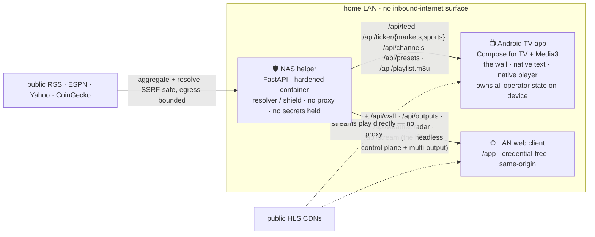

- **The TV app (the wall).** Native Android TV on an Onn 4K box. Renders the feed as native text,
  plays video in the native player, owns the menu and all operator interaction, persists the
  operator's lineup/settings **on-device**. Holds no credentials.
- **The helper (back-of-house).** A minimal Python/FastAPI service in a **hardened Docker
  container** (non-root, read-only rootfs, all caps dropped, `no-new-privileges`) with an
  **SSRF-safe fetcher**. It does exactly two jobs — aggregate news and resolve stream addresses —
  and *nothing else*. It never reaches into other services on its host.
- **The LAN web client.** Served by the helper at `/app`, same-origin, credential-free,
  CSP-locked, `hls.js` vendored (no CDN). A read-only viewer — playback, never an in-app reader.

Full design + the *why-native-over-web* decision: [`ARCHITECTURE.md`](ARCHITECTURE.md) ·
[`docs/foundation/`](docs/foundation/).

---

## This isn't a toy

A homelab project, held to real engineering standards:

- **Adversarially reviewed** (June 2026) — five parallel deep readers across failure dimensions,
  every finding independently re-verified by a skeptic before it counted; **zero P0**, and the
  honest-degradation discipline held end-to-end.
- **A real CI gate** — every push runs the helper test suite, a cross-component `schema_version`
  consistency check, the **adb deploy-invariant** gate, the web client tests, a **docs-hygiene**
  gate (no topology/personal-config leakage in public docs), the app JVM unit tests, and a
  **phantom zero-egress smoke test**. Green, secret-free, test/lint-only (a release-signing job in
  CI is forbidden — the key never leaves the operator's machine).
- **A maintenance charter** — [`MAINTENANCE-CHARTER.md`](MAINTENANCE-CHARTER.md) turns each problem an
  audit caught into a can't-slip-in-again check: an **enforced** CI layer + a **ritual** phase-end
  checklist ([`docs/PHASE-END-CHECKLIST.md`](docs/PHASE-END-CHECKLIST.md)), built to grow.
- **A deploy invariant that's been proven on hardware** — the app ships via `adb push` →
  **byte-verify** → `pm install` → confirm `lastUpdateTime` (never a streamed install that can
  truncate over a flaky link); the helper rebuilds its image and verifies the running
  `build_sha`.
- **Demo / phantom mode** — a tested **zero-outbound** contract for the helper, so anyone can run
  the wall with mock data and no secrets (it's how the quickstart above works, and how the
  screenshots are captured reproducibly in CI).

The guardrails that keep all of this true are codified in [`AGENTS.md`](AGENTS.md) — read it first
if you (or an AI agent) are going to touch the repo.

---

## Gallery

**Web wall (automated, demo mode)** — regenerate any time with the Playwright tool in
[`tools/screenshots/`](tools/screenshots/), or download the artifact from the **Screenshots**
GitHub Action. See [`docs/screenshots/`](docs/screenshots/) for what each shot shows.

**The real thing — native TV on the wall** (operator drop-in slots — these are labeled
placeholders until the real captures land; see [`docs/screenshots/device/`](docs/screenshots/device/)):

| | |
|---|---|
| 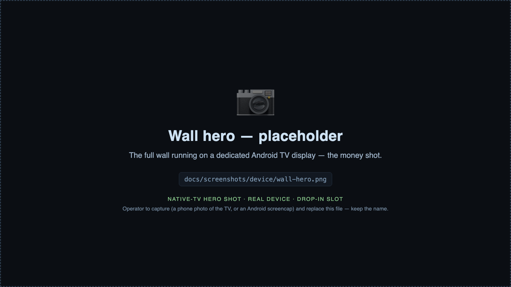 | 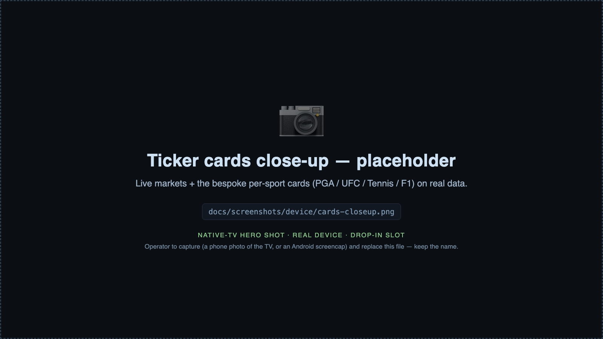 |
| 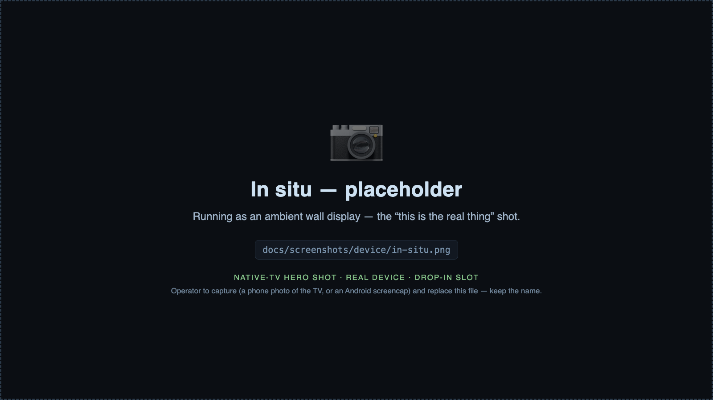 | *The live-data wall running on a dedicated Android TV display — markets ticking, the per-sport cards, real channels playing. An automated tool can't photograph the panel; these are the operator's drop-in shots.* |

**Record a video demo** of the live wall with one command — `make record-demo` captures the
device screen at native quality over adb (free, via [scrcpy](https://github.com/Genymobile/scrcpy);
no camera). You drive the menu walkthrough while it records; see
[`tools/capture/README.md`](tools/capture/README.md) for the shot list.

---

## Run it for real

The quickstart above is demo mode. For the real wall — live public RSS + markets + sports,
real channels, on an actual TV — follow [`ONBOARDING.md`](ONBOARDING.md). Prefer to hand it to
your AI assistant? Point it at [`docs/onboarding/ONBOARD-01-SETUP.md`](docs/onboarding/ONBOARD-01-SETUP.md).

## Precedence (when principles tension)

1. **Security** — never a path into the home network.
2. **Shared-friend safety** — over the operator's own convenience and data.
3. **Data durability** — over everything below.
4. **Honest staleness** — over visual polish.
5. **Feed-level resilience** — lowest; a dead tile is forgivable.

Cross-cutting: **one-click-easy content** — routine content changes never ride the deploy path.

## Standards & hard constraints

Conventional commits, semver + tagged releases, pinned dependencies + committed lockfiles, no
secrets in code or logs, signed installs, single-command test runners. See
[`CONTRIBUTING.md`](CONTRIBUTING.md) and [`SECURITY-PRACTICES.md`](SECURITY-PRACTICES.md).

- **No browser engine in the content path.** Feed is native text; video is the native player.
- **Never touch unrelated services on the helper's host.** It runs isolated, on its own network.
- **No third-party telemetry.** Nothing about what the operator watches leaves their infrastructure.

## License

MIT. See [`LICENSE`](LICENSE).
